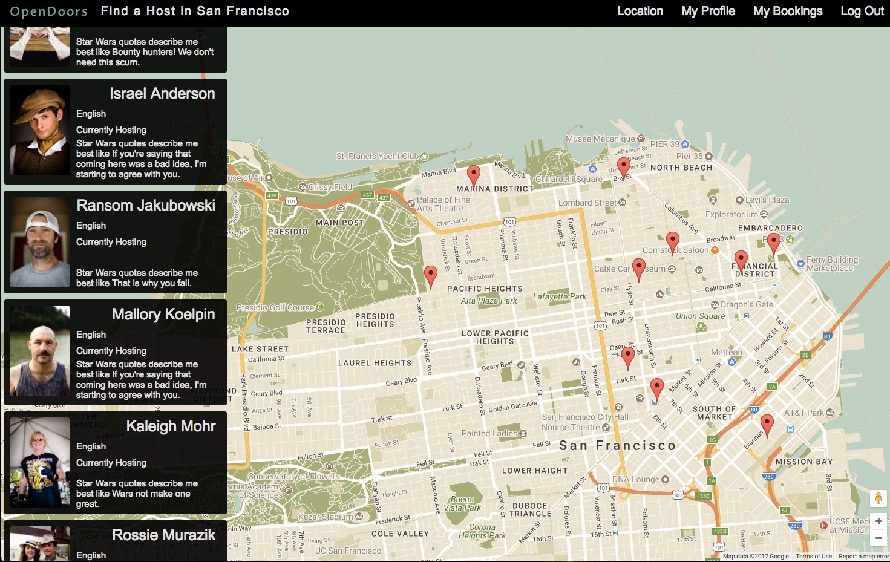

# OpenDoors

URL: [Live Link](https://open-doors22.herokuapp.com/#/)

OpenDoors is a web application meant to connect travelers looking for a room with locals wanting to open their doors to the world. It is built using Ruby on Rails and React.js and is a clone of the popular sight [Couchsurfing](https://www.couchsurfing.com/).

## Contents
**Features**

* User Authentication
* Map of Listings with Filters
* Listing Show Page
* Book a Trip
* Leave a Reference
* User Profile

## Project Information
This project was developed in 10 days utilizing Ruby on Rails, React.js with Redux, and Google Maps.

## Features
  * Account creation and authentication
  * Users can update and edit their personal profile and listing
  * View Hosting Page
  * Make a request to stay
  * Approve and Deny Bookings
  * Host and travelers can view trips unique to them
  * Users can leave references on a host
  * Ability to view host personal info and references

## User Authentication
On the back-end, an encrypted, hashed password is stored in the database (passwords are never saved to the database). On log-in, the provided password is rehashed and compared to the encrypted password in order to verify the log-in. Upon Sign-up new users are redirected to their edit information page where they can optionally provide additional information.

## Map of Listings with Filters
OpenDoors offers filtering based on city selection. The Redux state is updated with a list of all the host in the specified city. It then populates a Google map with markers of the hostings in the specified city. Additionally, a side bar showing all of the hostings currently within the bounds of the local Google maps floats over the left side of the map. As the map bound changes by dragging or zooming out, this side bar dynamically updates to show only the listings currently in view.

## Listing Show Page
By clicking on either the listings mentioned in the side bar above or the map markers, the current user will be redirected to host show page. Here a user has the ability to view information about the host, view references other users have left, leave a reference, or request a stay.

## User Profile Page
The user profile page allows the users to see upcoming trips, hostings, and references unique to that user. Additionally, a user has the ability to edit their profile information which is seen by other users who view their profile.

## Book A Trip
All trips are stored in one table in the database, which contains columns for `id`, the `host_id`, `user_id` which references the user who is traveling, the `booking message`, and the `dates` of the trip. Validation checks ensure that the date range is neither in the past or in reverse order. A host then has the ability to approve or decline requested trips. Additionally, both users have the ability to cancel of a trip if the need arises.

## Leave A Reference
All References are stored in one table in the database, which contains columns for `id`, the `host_id`, `user_id` which references the user who is traveling, and the `comment`. Upon creation the reference shows on the host listing page and the user profile page. Validation checks ensure a user may only leave one reference per host.

## Future Concepts
Below is a non-comprehensive list of features I would like to implement.

#### Search by availability
This is will allow users to to filter results shown on the map by hostings which are available within a specified date range.

#### Port to React Native
Integration with mobile using React Native.

#### Drop down map markers
Instead of populating the map with all markers for the filtered city initially. I would like to implement a feature where the map markers are added as the google maps viewing window is changed. The markers would "drop down" onto their location to as an additional wow factor.

#### Refactor
I would like to DRY out the code by refactoring components into sub-components and making more general optimizations at bottleneck points.
